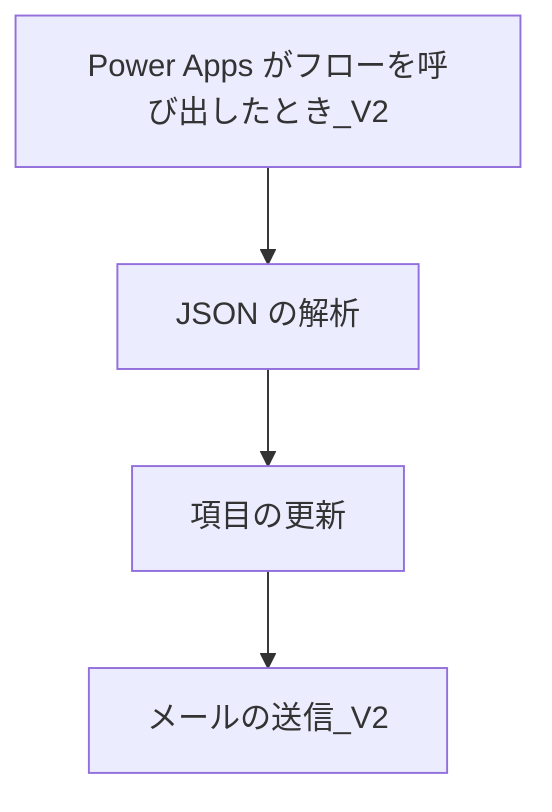

# **Power Automate 設計書**
<div style="width: 100%; background-color: #e0f2fe; border-bottom: 1px solid #bae6fd; padding: 16px 24px;">
  <div style="max-width: 1280px; margin: 0 auto; display: flex; justify-content: space-between; align-items: flex-start;">
    <!-- 左側の見出し -->
    <h1 style="font-size: 30px; font-weight: bold; color: #1f2937; margin: 0;">
      システム管理画面
    </h1>

    <!-- 右側のユーザー情報とステータス -->
    <div style="display: flex; flex-direction: column; gap: 12px;">
      <!-- ユーザー情報 -->
      <div style="background-color: white; padding: 8px 16px; border-radius: 4px; border: 1px solid #bae6fd; width: 256px;">
        <div style="display: flex; align-items: center;">
          <span style="color: #4b5563; width: 80px;">ユーザー:</span>
          <div style="display: flex; flex-direction: column;">
            <span style="font-size: 14px; font-weight: 500; color: #1f2937;">山田 太郎</span>
            <span style="font-size: 12px; color: #6b7280;">システム管理者</span>
          </div>
        </div>
      </div>

      <!-- ステータス表示 -->
      <div style="background-color: white; padding: 8px 16px; border-radius: 4px; border: 1px solid #bae6fd; width: 256px;">
        <div style="display: flex; align-items: center;">
          <span style="color: #4b5563; width: 80px;">ステータス:</span>
          <div style="display: flex; align-items: center;">
            <span style="height: 8px; width: 8px; background-color: #22c55e; border-radius: 50%; margin-right: 8px;"></span>
            <span style="font-size: 14px; color: #4b5563;">オンライン</span>
          </div>
        </div>
      </div>

      <!-- タスク通知 -->
      <div style="background-color: white; padding: 8px 16px; border-radius: 4px; border: 1px solid #bae6fd; width: 256px;">
        <div style="display: flex; align-items: center;">
          <span style="color: #4b5563; width: 80px;">タスク:</span>
          <div style="display: flex; align-items: center; gap: 8px; color: #4b5563;">
            <span style="font-size: 14px;">3件 未対応</span>
          </div>
        </div>
      </div>
    </div>
  </div>
</div>
### **1. 概要**
PowerAppsからトリガーされ、以下のタスクを実行するフローです。
- PowerAppsからデータを受け取る。
- SharePointリストのステータスを更新。
- 担当者にメールで通知。
- JSON文字列を解析して必要なデータを取得。
<div style="width: 100%; background-color: #e0f2fe; border-bottom: 1px solid #bae6fd; padding: 16px 24px;">
  <div style="max-width: 1280px; margin: 0 auto; display: flex; justify-content: space-between; align-items: flex-start;">
    <!-- 左側の見出し -->
    <h1 style="font-size: 30px; font-weight: bold; color: #1f2937; margin: 0;">
      システム管理画面
    </h1>

    <!-- 右側のユーザー情報とステータス -->
    <div style="display: flex; flex-direction: column; gap: 12px;">
      <!-- ユーザー情報 -->
      <div style="background-color: white; padding: 8px 16px; border-radius: 4px; border: 1px solid #bae6fd; width: 256px;">
        <div style="display: flex; align-items: center;">
          <span style="color: #4b5563; width: 80px;">ユーザー:</span>
          <div style="display: flex; flex-direction: column;">
            <span style="font-size: 14px; font-weight: 500; color: #1f2937;">山田 太郎</span>
            <span style="font-size: 12px; color: #6b7280;">システム管理者</span>
          </div>
        </div>
      </div>

      <!-- ステータス表示 -->
      <div style="background-color: white; padding: 8px 16px; border-radius: 4px; border: 1px solid #bae6fd; width: 256px;">
        <div style="display: flex; align-items: center;">
          <span style="color: #4b5563; width: 80px;">ステータス:</span>
          <div style="display: flex; align-items: center;">
            <span style="height: 8px; width: 8px; background-color: #22c55e; border-radius: 50%; margin-right: 8px;"></span>
            <span style="font-size: 14px; color: #4b5563;">オンライン</span>
          </div>
        </div>
      </div>

      <!-- タスク通知 -->
      <div style="background-color: white; padding: 8px 16px; border-radius: 4px; border: 1px solid #bae6fd; width: 256px;">
        <div style="display: flex; align-items: center;">
          <span style="color: #4b5563; width: 80px;">タスク:</span>
          <div style="display: flex; align-items: center; gap: 8px; color: #4b5563;">
            <span style="font-size: 14px;">3件 未対応</span>
          </div>
        </div>
      </div>
    </div>
  </div>
</div>
---

### **2. トリガー**

#### **アクション名**: PowerApps (V2)
- **目的**: PowerAppsから必要なデータを受け取ります。
- **入力データ**:
  | 引数名         | データ型    | 説明                                     |
  |----------------|-------------|-----------------------------------------|
  | `ItemID`       | 数値または文字列 | SharePointリストアイテムのID              |
  | `StatusCode`   | 数値または文字列 | 更新するステータスコード                  |
  | `AssigneeEmail`| 文字列        | 担当者のメールアドレス                    |
  | `AssigneeName` | 文字列        | 担当者の名前                             |
  | `AssigneeDept` | 文字列        | 担当者の部署名                           |
  | `ApplicationData`| JSON文字列 | 申請情報を含むJSONデータ                  |

---

### **3. JSON解析**

#### **アクション名**: Parse JSON
- **目的**: JSON文字列を解析し、申請情報を個別に利用できる形式にします。
- **入力データ**:
  - PowerAppsトリガーから渡された`ApplicationData`
- **処理内容**:
  - JSONスキーマを使用して以下の項目を解析:
    | 項目名           | データ型    | 説明                                     |
    |------------------|-------------|-----------------------------------------|
    | `DocumentName`   | 文字列        | 資料名                                   |
    | `ApplicationType`| 文字列        | 申請種別                                 |
    | `ApplicationDept`| 文字列        | 申請所管                                 |
    | `ApplicantName`  | 文字列        | 申請者名                                 |
    | `ApplicationDate`| 文字列        | 申請日（YYYY-MM-DD形式）                 |
    | `WorkflowStage`  | 文字列        | 現在のワークフローの段階                 |

---

### **4. SharePointリスト更新**

#### **アクション名**: Get Item
- **目的**: SharePointリストから対象アイテムを取得します。
- **入力データ**:
  - サイトURL: 対象のSharePointサイトURL
  - リスト名: 対象のリスト名
  - アイテムID: PowerAppsから受け取った`ItemID`
- **出力データ**:
  - SharePointアイテムの現在のデータ。

#### **アクション名**: Update Item
- **目的**: SharePointリストアイテムのステータスを更新します。
- **入力データ**:
  - サイトURL: 同上
  - リスト名: 同上
  - アイテムID: PowerAppsから受け取った`ItemID`
  - 更新内容:
    | フィールド名 | 値                      | 説明                                     |
    |--------------|--------------------------|-----------------------------------------|
    | Status       | `StatusCode`             | 更新後のステータス                     |
    | ModifiedBy   | `AssigneeName`           | 担当者名                               |
    | ModifiedByDept| `AssigneeDept`          | 担当者部署                             |

---

### **5. メール通知**

#### **アクション名**: Send an email (V2)
- **目的**: 担当者に申請内容の更新を通知します。
- **入力データ**:
  - 宛先: `AssigneeEmail`
  - 件名:
    ```plaintext
    @{outputs('Parse_JSON')?['ApplicationType']}申請　@{outputs('Parse_JSON')?['DocumentName']}
    ```
  - 本文（HTML形式）:
    ```html
    <p>以下の申請が更新されました。</p>
    <table style="border: 1px solid black; border-collapse: collapse; width: 100%;">
      <tr style="background-color: #f2f2f2;">
        <th style="border: 1px solid black; padding: 8px;">項目</th>
        <th style="border: 1px solid black; padding: 8px;">内容</th>
      </tr>
      <tr>
        <td style="border: 1px solid black; padding: 8px;">申請種別</td>
        <td style="border: 1px solid black; padding: 8px;">@{outputs('Parse_JSON')?['ApplicationType']}</td>
      </tr>
      <tr>
        <td style="border: 1px solid black; padding: 8px;">申請所管</td>
        <td style="border: 1px solid black; padding: 8px;">@{outputs('Parse_JSON')?['ApplicationDept']}</td>
      </tr>
      <tr>
        <td style="border: 1px solid black; padding: 8px;">申請者名</td>
        <td style="border: 1px solid black; padding: 8px;">@{outputs('Parse_JSON')?['ApplicantName']}</td>
      </tr>
      <tr>
        <td style="border: 1px solid black; padding: 8px;">資料名</td>
        <td style="border: 1px solid black; padding: 8px;">@{outputs('Parse_JSON')?['DocumentName']}</td>
      </tr>
      <tr>
        <td style="border: 1px solid black; padding: 8px;">申請日</td>
        <td style="border: 1px solid black; padding: 8px;">@{outputs('Parse_JSON')?['ApplicationDate']}</td>
      </tr>
      <tr>
        <td style="border: 1px solid black; padding: 8px;">現在のワークフローの段階</td>
        <td style="border: 1px solid black; padding: 8px;">@{outputs('Parse_JSON')?['WorkflowStage']}</td>
      </tr>
      <tr>
        <td style="border: 1px solid black; padding: 8px;">担当者名</td>
        <td style="border: 1px solid black; padding: 8px;">@{triggerBody()?['AssigneeName']}</td>
      </tr>
      <tr>
        <td style="border: 1px solid black; padding: 8px;">担当者部署</td>
        <td style="border: 1px solid black; padding: 8px;">@{triggerBody()?['AssigneeDept']}</td>
      </tr>
    </table>
    <p>詳細はSharePointリストをご確認ください。</p>
    ```

---

### **6. エラー処理**

#### **アクション名**: Scope (Main Process)
- **目的**: メイン処理をスコープで囲み、エラーをキャッチします。

#### **アクション名**: Send an email (Error Notification)
- **目的**: 管理者にエラー内容を通知します。
- **入力データ**:
  - 宛先: 管理者メールアドレス
  - 件名: 「Power Automateフローエラー通知」
  - 本文: エラーの詳細とトリガーデータを記載。


